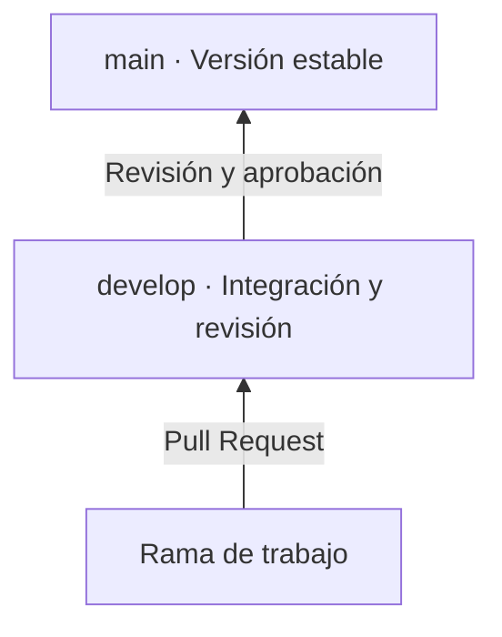

# Programación Avanzada

Repositorio académico colaborativo de la asignatura **Programación Avanzada**, administrado por la **Sección de Ingeniería de Software**.

Este espacio reúne los materiales del curso para facilitar su consulta, actualización y uso por parte de docentes y estudiantes.

## Estructura

```text
programacion-avanzada/
├── README.md
├── informacion-asignatura/
│   ├── README.md
│   ├── syllabus.pdf
│   └── bibliografia/
├── contenido-semanal/
│   ├── README.md
│   ├── semana-01/
│   ├── semana-02/
│   ├── ...
│   └── semana-16/
├── proyectos/
│   ├── README.md
│   ├── proyecto-C++/
│   └── proyecto-JAVA/
└── evaluaciones/
    ├── README.md
    ├── evaluacion-C++/
    └── evaluacion-JAVA/
```

## Secciones principales

- [`informacion-asignatura`](informacion-asignatura/): syllabus, bibliografía y recursos generales.
- [`contenido-semanal`](contenido-semanal/): materiales organizados por semanas.
- [`proyectos`](proyectos/): enunciados, recursos y proyectos de referencia.
- [`evaluaciones`](evaluaciones/): actividades de evaluación y orientaciones académicas.

Cada carpeta cuenta con un `README.md` que describe su contenido y forma de organización.

## Convenciones

Los nombres de carpetas y archivos deben escribirse preferiblemente:

- En minúsculas.
- Sin tildes ni espacios.
- Con palabras separadas por guiones.
- Con nombres breves y descriptivos.

Ejemplos: `semana-01`, `taller-excepciones.pdf` y `ejemplo-patron-observer`.

Los documentos se publicarán preferiblemente en PDF, las orientaciones en Markdown y los ejemplos en su formato de código fuente.

## Contribuidores

Este repositorio cuenta con la participación de los monitores académicos que apoyan la construcción, organización y actualización del material académico de la asignatura bajo la dirección de la Sección de Ingeniería de Software.

| Nombre | Correo institucional | Programa académico |
| --- | --- | --- |
| Juan Pablo Arias Buitrago | [ariasj.u@javeriana.edu.co](mailto:ariasj.u@javeriana.edu.co) | Ciencia de Datos |
| Valeria Cortés Rendón | [cortesvaleria@javeriana.edu.co](mailto:cortesvaleria@javeriana.edu.co) | Ingeniería de Sistemas |
| Carolina Ujueta Ricardo | [c_ujueta@javeriana.edu.co](mailto:c_ujueta@javeriana.edu.co) | Ingeniería de Sistemas |
| Mateo Zamora Pérez | [zamorapmateo@javeriana.edu.co](mailto:zamorapmateo@javeriana.edu.co) | Ingeniería de Sistemas |
| Ana María Jara Vargas | [jara.amaria@javeriana.edu.co](mailto:jara.amaria@javeriana.edu.co) | Biología |

## Flujo de trabajo

El repositorio utiliza un flujo basado en **GitFlow**, con `develop` como rama de integración y `main` como rama estable.

### Ramas principales

- `main`: contiene únicamente material revisado y aprobado por la **Sección de Ingeniería de Software**.
- `develop`: integra los aportes de los contribuidores antes de su publicación.
- Ramas de trabajo: se crean desde `develop` para elaborar materiales o realizar cambios específicos.

### Proceso de contribución

1. Actualizar la rama `develop` local.
2. Crear desde `develop` una rama de trabajo con un nombre breve y descriptivo; por ejemplo, `feature/semana-03-excepciones`.
3. Realizar los cambios y documentarlos de acuerdo con las convenciones del repositorio.
4. Abrir un **Pull Request hacia `develop`**.
5. Atender los comentarios o ajustes solicitados durante la revisión.
6. Una vez aprobado, integrar el cambio a `develop`.
7. La **Sección de Ingeniería de Software** integrará `develop` a `main` cuando el material esté completo, organizado y listo para su publicación.

> **Importante:** no se deben realizar cambios directamente sobre `main`. Todo aporte debe pasar primero por `develop` y contar con la revisión correspondiente.

### Flujo general



## Derechos de autor

Antes de incorporar un material, se debe verificar su pertinencia académica, autoría, ubicación y autorización de uso.

© Autores de los respectivos materiales. Se autoriza su consulta y uso individual con fines académicos, educativos y no comerciales, de acuerdo con las condiciones establecidas en [`LICENSE.md`](LICENSE.md).

## Administración

**Sección de Ingeniería de Software**  
[seccionsw_dis@javeriana.edu.co](mailto:seccionsw_dis@javeriana.edu.co)  
Departamento de Ingeniería de Sistemas, Facultad de Ingeniería  
Pontificia Universidad Javeriana
